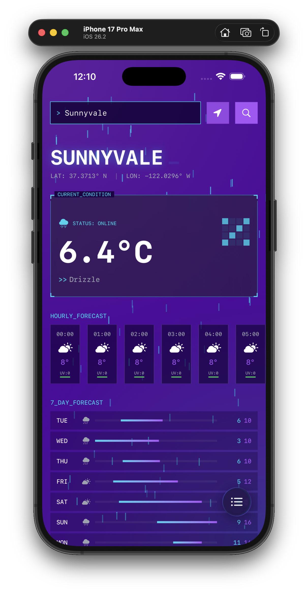
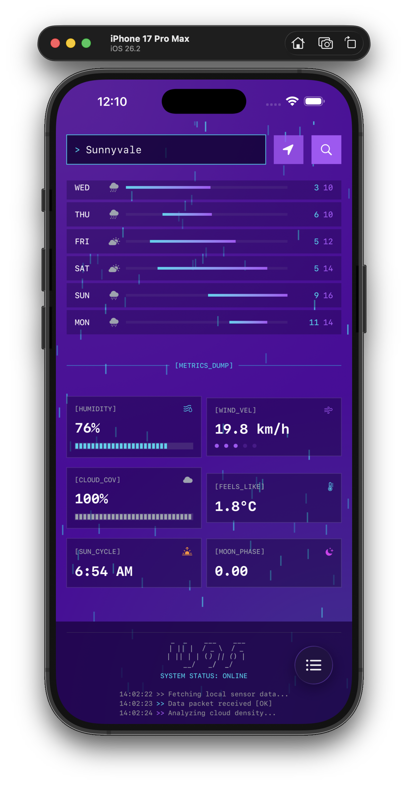
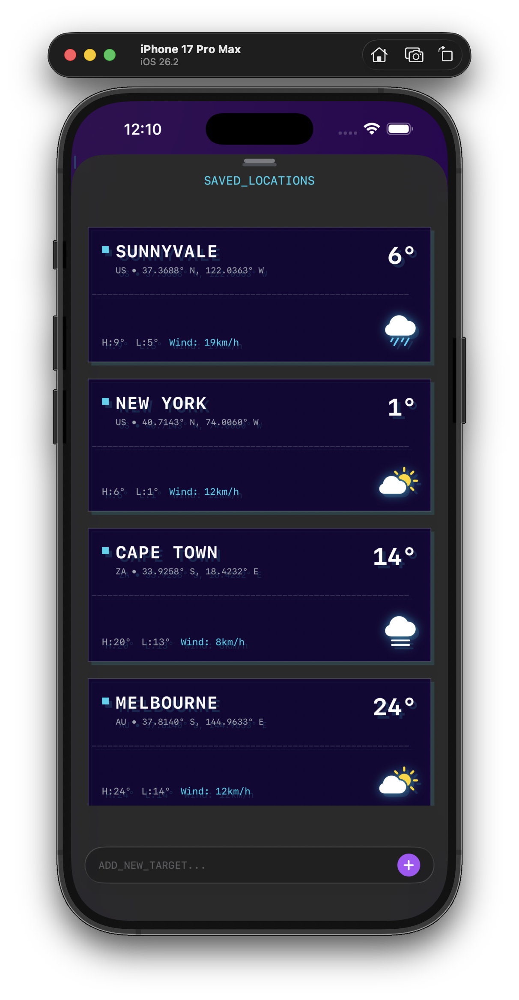
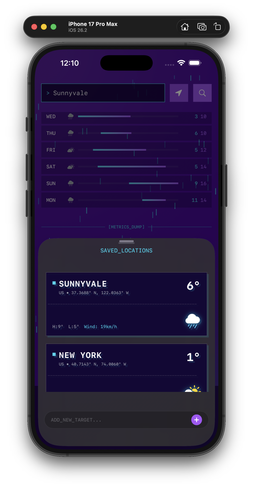

# Aether iOS App ⛈️

**Aether** is a next-generation weather client that prioritizes aesthetics, privacy, and performance. Built entirely in Swift 6 and SwiftUI, it delivers a futuristic "Jules Verne" inspired interface while maintaining robust architectural principles.

---

## 📸 Product Showcase

Aether's design is its core feature. Here's a look at the futuristic interface.

<p align="center">
  
  
</p>

<p align="center">
  
  
</p>

---

## 🛠 Tech Stack

-   **Language**: Swift 6
-   **UI Framework**: SwiftUI
-   **Persistence**: SwiftData (`@Model`-driven architecture)
-   **Concurrency**: Swift Concurrency (Async/Await, Actors)
-   **Networking**: Native `URLSession`
-   **Minimum Target**: macOS 14.0

---

## 🏗 Architecture & Design Decisions

### 1. Privacy-First API Strategy (Open-Meteo)
Aether is built on the philosophy that weather data should be free and private.
-   **No API Keys**: We utilize [Open-Meteo](https://open-meteo.com/), an open-source weather API that requires no authentication keys. This makes the project easy to fork and run without setup.
-   **Two-Step Fetch Process**: Since Open-Meteo's weather endpoint requires coordinates, we implemented a robust **Geocoding → Weather** pipeline:
    1.  User searches for a city → App queries the Geocoding API to get `(lat, lon)`.
    2.  App uses these coordinates to fetch precise weather data.
    This resolves the common issue of premium-tier restrictions found in other weather APIs.

### 2. High-Performance Caching Layer
To reduce network load and improve responsiveness, Aether implements a custom in-memory caching system using Swift **Actors**.
-   **Thread Safety**: The `WeatherCache` actor ensures thread-safe access to cached data in a concurrent environment.
-   **Dual-Level Caching**:
    -   **Geocoding Results**: Cached by city name to prevent redundant lookups for the same location.
    -   **Weather Data**: Cached by coordinate key `(lat, lon)` with a **30-minute validity period**.
    -   *Result*: Instant load times for frequently accessed locations and reduced API strain.

### 3. Modern Data Persistence (SwiftData)
We leveraged Apple's latest persistence framework, **SwiftData**, to manage user favorites.
-   **The `City` Model**: Defined as a `@Model` class, allowing seamless binding to SwiftUI views.
-   **Feature Set**: Supports adding, removing, and reordering locations, with persistent storage of metadata like country codes and coordinates.

### 4. "JulesTheme" Design System
The visual identity is centralized in `JulesTheme.swift`, ensuring consistency across the app.
-   **Glassmorphism**: A custom implementation using `UltraThinMaterial` combined with subtle gradients and borders to create a "liquid glass" effect.
-   **Color Palette**: A curated set of deep space purples (`#1d0245`) and neon accents (Cyan `#22d3ee`, Purple `#a855f7`) to evoke a sci-fi atmosphere.
-   **Typography**: Monospaced fonts are used throughout to reinforce the "terminal/dashboard" aesthetic.

---

## 🚀 Setup & Run

1.  **Clone the Repository**
    ```bash
    git clone https://github.com/your-username/Aether.git
    cd Aether
    ```

2.  **Open in Xcode**
    -   Double-click `Aether.xcodeproj`.
    -   Ensure you are using **Xcode 15+**.

3.  **Build & Run**
    -   Select your target (My Mac).
    -   Press `Cmd + R` to run.
    -   *Note*: No `.env` file or API keys are required!

---

*Created by Arboy Magomba.*
